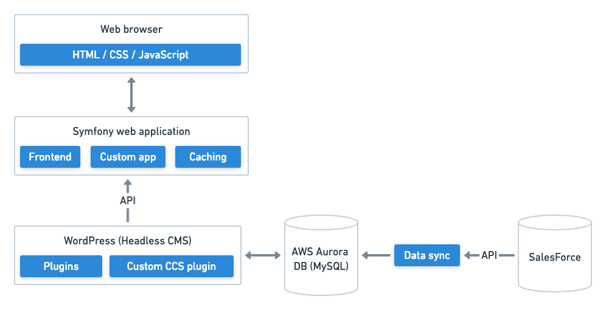

# Website architecture

## System diagram

## System overview

### Headless CMS

Decoupling the backend CMS (WordPress) and the frontend website is known as a "Headless CMS" architecture. This allows 
us to focus on delivering exactly what we need for the CCS website without worrying about any restrictions or performance 
considerations from WordPress. This approach also keeps the website more flexible for the future, we can more easily 
integrate multiple data sources or even swap out the backend CMS in the future if required. 

### Web browser

The frontend website itself, built using standards-based HTML, CSS and JavaScript for progressive enhancement. All 
content is served as server-side generated HTML from the server, which is more reliable and more accessible / SEO friendly.  

### Symfony web application

The website is generated from a Symfony web application. This basically reads in data from an API endpoint, filters 
this into a content model (which we define in the application) and displays this in [Twig templates](https://twig.symfony.com/) 
which generate the HTML pages displayed in a web browser. Data read in from the API is cached to increase performance.

The Symfony application also powers the listing and search pages and builds web forms that use the standard Salesforce 
Web to Case functionality. 

### Frontend software

The core software which enables us to build the Headless CMS architecture is [Frontend](https://github.com/studio24/frontend), 
open source software developed by Studio 24 and used on Headless CMS projects. This software has unit tests and 
code quality static analysis run via Travis.

This software provide generic functionality such as reading in content from an API and mapping this to a content 
object, pagination, and navigation.  

Studio 24 maintain and develop the Frontend app externally from the CCS project and any new features will be integrated 
into CCS in the future as part of our maintenance work. 

### How to file bugs for the Frontend dependency

Studio 24 maintain a list of bugs on GitHub at https://github.com/strata/frontend/issues

You can review this list to see if your issue is known, or you can create a new bug report by selecting “New issue” and “Bug report.” It’s important to include details on what the issue is, how to reproduce it, and what you think expected behaviour should be. Please note this is a public issue list, so please do not post any sensitive or confidential details to GitHub issues.

If you believe you can fix the issue, please do so in a branch in Git and submit a Pull Request to fix this. Please ensure you write a unit test to help confirm the fix and help future maintenance of the project. Please note Studio 24 will need to approve the PR before it can be merged into master and a new release created (which can then be loaded via a composer update).

The Frontend project is an open source project maintained by Studio 24. Issues are fixed in priority order, if you need to chase a support issue please contact Studio 24 via the normal support channels.

### WordPress CMS

[WordPress](https://wordpress.org/) is used as the Content Management System (CMS) and is used to manage page content 
on the CCS website and rich text content for the Frameworks and Suppliers section of the website. 

#### WordPress CMS Rest API

The frontend receives data from WordPress via the [WordPress Rest API](https://developer.wordpress.org/rest-api/). You can 
view all of the endpoints for the rest API by visiting [cms-url]/wp-json/wp/v2/

Firefox formats this data in an easily readable format. Chrome by default outputs this data in a raw format, but you can install 
extensions to format this data for better readability, for example:

[https://chrome.google.com/webstore/detail/json-formatter/](https://chrome.google.com/webstore/detail/json-formatter/)

It is strongly recommended that you have some easy and clear way of reading the data from this URL as it is key to understanding the 
data that is coming from WordPress.

There are also some custom endpoints defined for the project that exist under:

[cms-url]/wp-json/ccs/v1/ 

You can read more about the Rest API at [WORDPRESS_REST_API.md](WORDPRESS_REST_API.md)

### AWS Aurora database

WordPress content and data synchronised from Salesforce is stored in a MySQL-compatible AWS Aurora database.

### Salesforce data

Salesforce is used by CCS to manage their supplier and framework data and content is exposed to the CCS website via 
standard Salesforce APIs. 

#### Data sync process

The data sync process imports data from standard Salesforce APIs and imports this into custom
 database tables in Aurora DB. This data is then used to power the website, so no website requests query live 
 data in Salesforce. The data sync process runs every at set intervals daily.
 
Find out more at [Salesforce to Website data sync process](SALESFORCE_DATA_SYNC.md).

