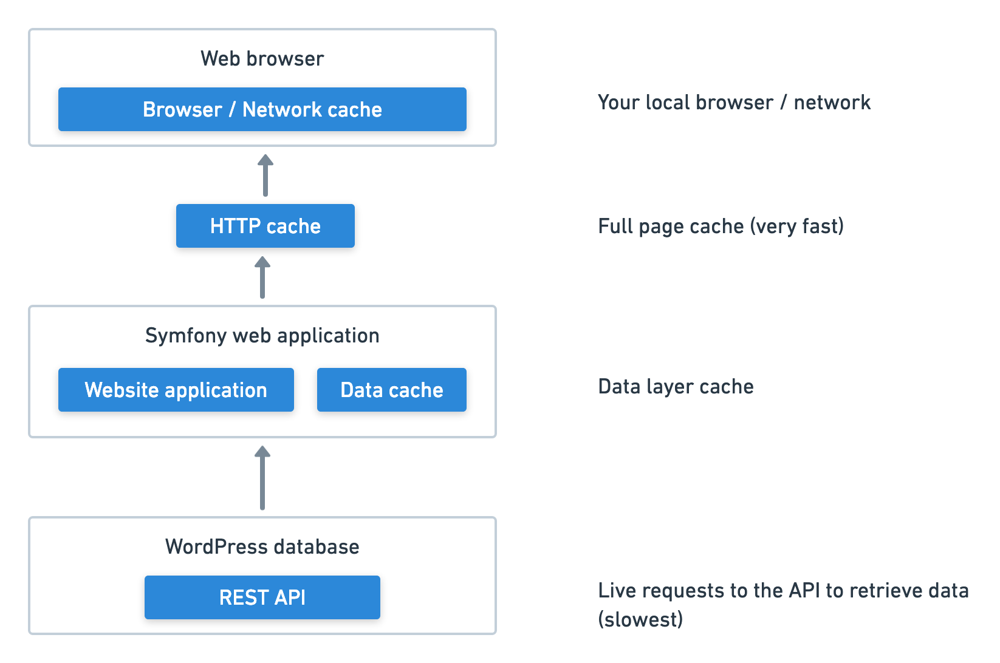

# Caching

## How a request is cached



There are multiple cache layers in the Frontend application in order to increase performance and ensure the website is more 
able to cope with higher traffic.

### Web pages

A request is generated in the following way:

* **Local network:** Request can be cached by local network cache (for example static assets are generally cached in this way)
* **HTTP Cache:** If request is sent to webserver, Symfony first checks the full page cache. On a match the full page is returned 
and no live data is generated. The [HTTP Cache](https://symfony.com/doc/current/http_cache.html) is part of the Symfony 
web app but it runs very early in the process and skips all normal Symfony framework processing.
* **Symfony web application:** If there is no match, Symfony then generates the page. Any API requests made to WordPress are first checked against a data 
cache which, if matches, is returned instead of running a live API query.
* **Query live API:** On no data layer cache, a live API query is run and the resulting page data is stored in the cache for future requests 

### Static assets

A request is generated in the following way:

* **Local network:** Request can be cached by local network cache
* **Webserver:** If request is sent to webserver, Apache serves the static asset

## Cache lifetime

### Web pages

The default cache lifetime is set to **15 minutes** for all web pages. 

This is the same for the full page cache (HTTP Cache) and the data layer cache used when requesting live data from the 
API. This is a trade off between freshness of data and an attempt to ensure the site can cope with higher traffic levels.

#### Modifying Web Page Cache Lifetimes

Cache lifetimes for the HTTP cache can be modified in the individual controllers found in `src/Controller`.

The cache lifetime should be set in the ``__constructor`` method, alongside the content type for the controller.

For example, see the constructor method for the events controller:

```php
    public function __construct(CacheInterface $cache)
    {
        $this->api = new Wordpress(
            getenv('APP_API_BASE_URL'),
            new ContentModel(__DIR__ . '/../../config/content/content-model.yaml')
        );
        $this->api->setContentType('events');
        $this->api->setCache($cache);
        $this->api->setCacheLifetime(900);
    }
```

You can see on the second last line that the cache lifetime is set to 900 seconds (15 minutes). This value can be changed as desired.

### Static assets

The default cache lifetime for static assets (e.g. CSS, images, JS) is **24 hours**.

## Clearing the cache

### Web pages

The cache is automatically cleared on a deployment to `ccs-frontend`.

You can manually clear the cache via the command-line via:

```
bin/console cache:clear
```

### Static assets

A hard refresh will reload the static assets from the server. Static assets are also reloaded if their name changes, or 
a unique URL parameter is added (e.g. `/assets/styles/styles.css?v=1.2.0`).

## Future recommended caching work

Add cache invalidation options to WordPress CMS to allow CCS to clear the cache for specific pages. 

We recommend adding [Varnish Cache](https://varnish-cache.org/) in the future for high-performance caching.

## Default cache headers

### Web pages

Default cache headers are set in `src/EventListener/ResponseListener.php`

* Sets default cache lifetime
* All pages can be cached in shared, public cache
* At end of cache lifetime must revalidate 

See https://developer.mozilla.org/en-US/docs/Web/HTTP/Caching

### Static assets

Default cache headers for static files are set in `deploy/files/httpd.conf`

```
# Cache control settings for static content (24hrs)
<filesMatch ".(ico|woff|woff2|png|gif|jpg|jpeg|svg|js|css)$">
    Header set Cache-Control "max-age=84600, public"
</filesMatch>
```

See https://developer.mozilla.org/en-US/docs/Web/HTTP/Caching
